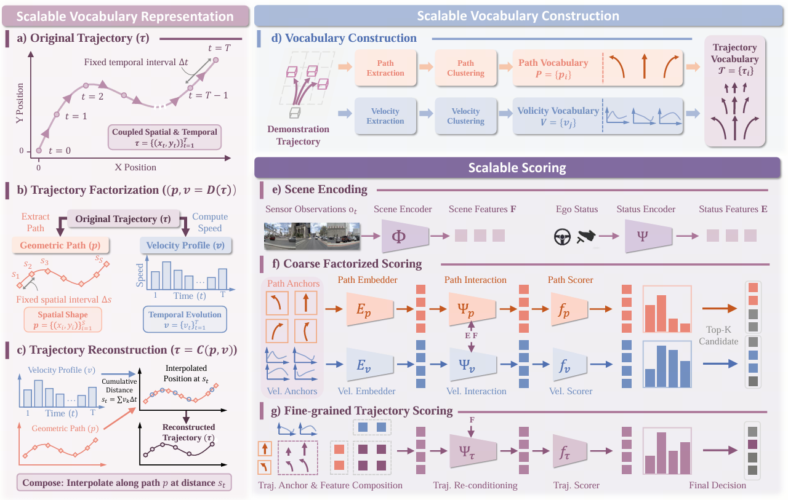
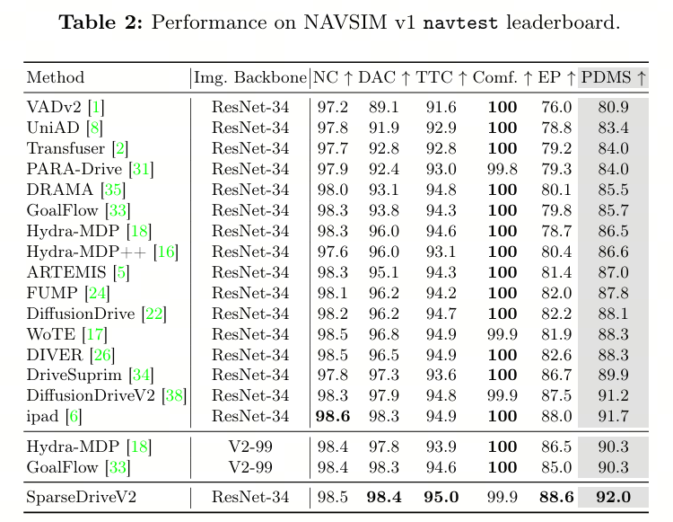
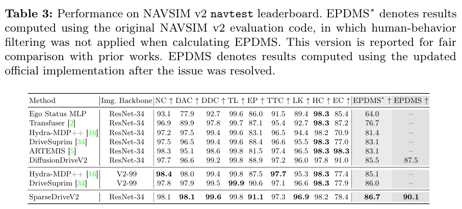
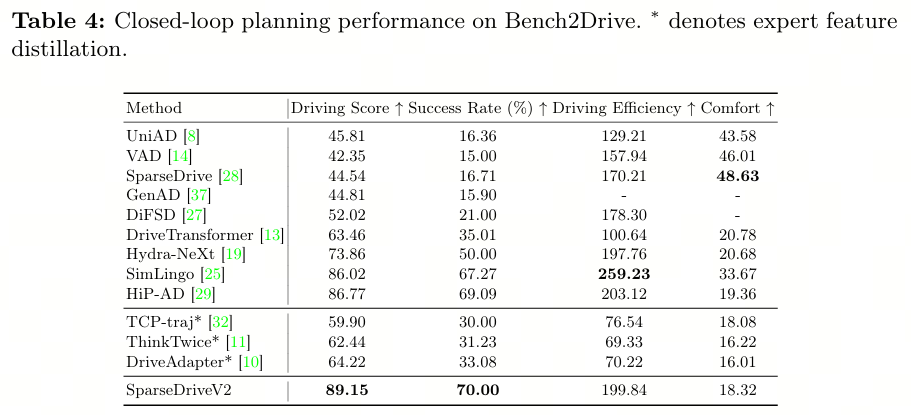
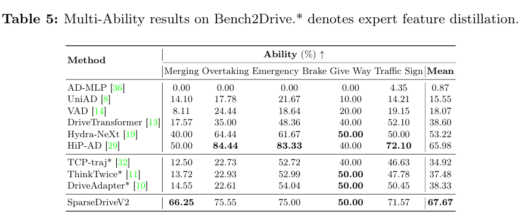

<div align="center">
<h2>SparseDriveV2: Scoring is All You Need for End-to-End Autonomous Driving</h2>

[Wenchao Sun](https://scholar.google.com/citations?user=yd-sMoQAAAAJ&hl=en&oi=sra)<sup>1,2</sup>, [Xuewu Lin](https://scholar.google.com/citations?user=pfXQwcQAAAAJ&hl=en&oi=sra)<sup>3</sup>, [Keyu Chen](https://scholar.google.com/citations?hl=en&user=m_bC1VAAAAAJ)<sup>1</sup>, [Zixiang Pei](https://scholar.google.com/citations?user=Lq4s0IsAAAAJ&hl=en&oi=ao)<sup>2</sup>,  \
[Xiang Li](https://openreview.net/profile?id=~Xiang_LI187)<sup>2</sup>, [Yining Shi](https://scholar.google.com/citations?user=2zOwf-QAAAAJ&hl=en&oi=sra)<sup>1</sup>, [Sifa Zheng](https://www.svm.tsinghua.edu.cn/essay/80/1835.html)<sup>1</sup>

<sup>1</sup> Tsinghua University \
<sup>2</sup> Horizon Continental Technology \
<sup>3</sup> Horizon
</div>

## News
* **` April. 1st, 2026`:** We released our paper on [arxiv](), and released the code and weights.

## Table of Contents
- [Introduction](#introduction)
- [Results](#results)
- [Getting Started](#getting-started)
- [Acknowledgement](#acknowledgement)
- [Citation](#citation)

## Introduction
End-to-end multi-modal planning has been widely adopted to model the uncertainty of driving behavior, typically by scoring candidate trajectories and selecting the optimal one. Existing approaches generally fall into two categories: scoring a large static trajectory vocabulary, or scoring a small set of dynamically generated proposals. While static vocabularies often suffer from coarse discretization of the action space, dynamic proposals provide finer-grained precision and have shown stronger empirical performance on existing benchmarks. However, it remains unclear whether dynamic generation is fundamentally necessary, or whether static vocabularies can already achieve comparable performance when they are sufficiently dense to cover the action space. In this work, we start with a systematic scaling study of Hydra-MDP, a representative scoring-based method, revealing that performance consistently improves as trajectory anchors become denser, without exhibiting saturation before computational constraints are reached. Motivated by this observation, we propose SparseDriveV2 to push the performance boundary of scoring-based planning through two complementary innovations: (1) a scalable vocabulary representation with a factorized structure that decomposes trajectories into geometric paths and velocity profiles, enabling combinatorial coverage of the action space, and (2) a scalable scoring strategy with coarse factorized scoring over paths and velocity profiles followed by fine-grained scoring on a small set of composed trajectories. By combining these two techniques, SparseDriveV2 scales the trajectory vocabulary to be 32x denser than prior methods, while still enabling efficient scoring over such super-dense candidate set. With a lightweight ResNet-34 as backbone, SparseDriveV2 achieves 92.0 PDMS and 90.1 EPDMS on NAVSIM, with 89.15 Driving Score and 70.00 Success Rate on Bench2Drive.

<div align="center">
<b>Overall architecture of SparseDriveV2. </b>

</div>

## Results
<div align="center">
  
  
  
  
</div>

## Getting Started

- [Getting started from NAVSIM environment preparation](https://github.com/autonomousvision/navsim?tab=readme-ov-file#getting-started-)
- [Data caching, Training and Evaluation](docs/train_eval.md)

### Checkpoint
> NAVSIMv1
| Method | Model Size | Backbone | PDMS | Weight Download |
| :---: | :---: | :---: | :---:  | :---: |
| SparseDriveV2 | 50.4M | [ResNet-34](https://huggingface.co/timm/resnet34.a1_in1k) | 92.22 | [Hugging Face](https://huggingface.co/wenchaosun/SparseDriveV2/resolve/main/sparsedrive_navsimv1_92p2.ckpt) |

> NAVSIMv2
| Method | Model Size | Backbone | EPDMS | Weight Download |
| :---: | :---: | :---: | :---:  | :---: |
| SparseDriveV2 | 50.9M | [ResNet-34](https://huggingface.co/timm/resnet34.a1_in1k) | 90.38 | [Hugging Face](https://huggingface.co/wenchaosun/SparseDriveV2/resolve/main/sparsedrive_navsimv2_90p3.ckpt) |


## Acknowledgement
SparseDriveV2 is greatly inspired by the following outstanding contributions to the open-source community: [NAVSIM](https://github.com/autonomousvision/navsim), [DiffusionDriveV2](https://github.com/hustvl/DiffusionDriveV2), [GTRS](https://github.com/NVlabs/GTRS).

## Citation
If you find SparseDriveV2 is useful in your research or applications, please consider giving us a star 🌟 and citing it by the following BibTeX entry.

```bibtex
```
